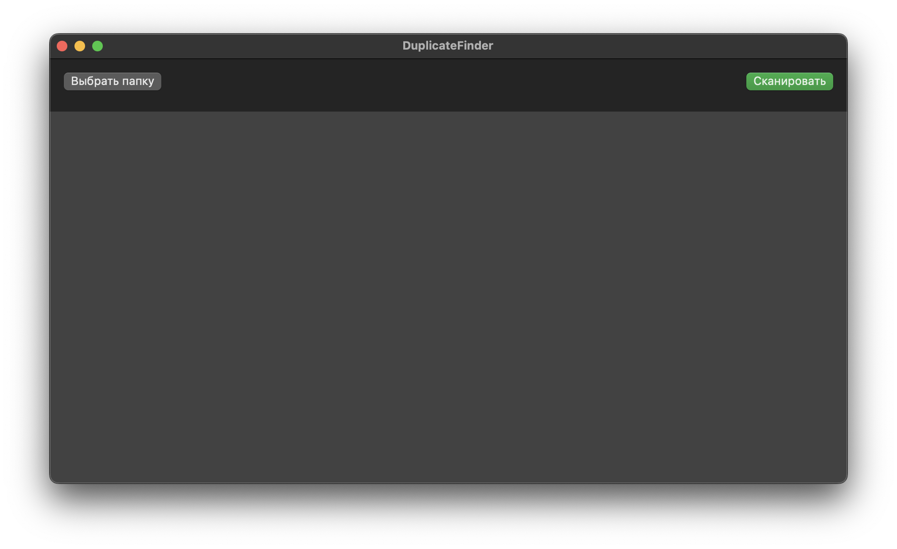
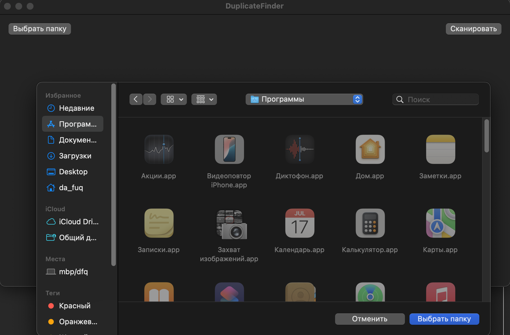
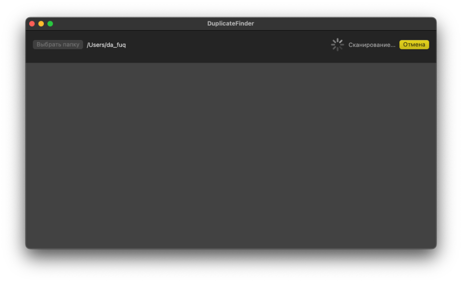
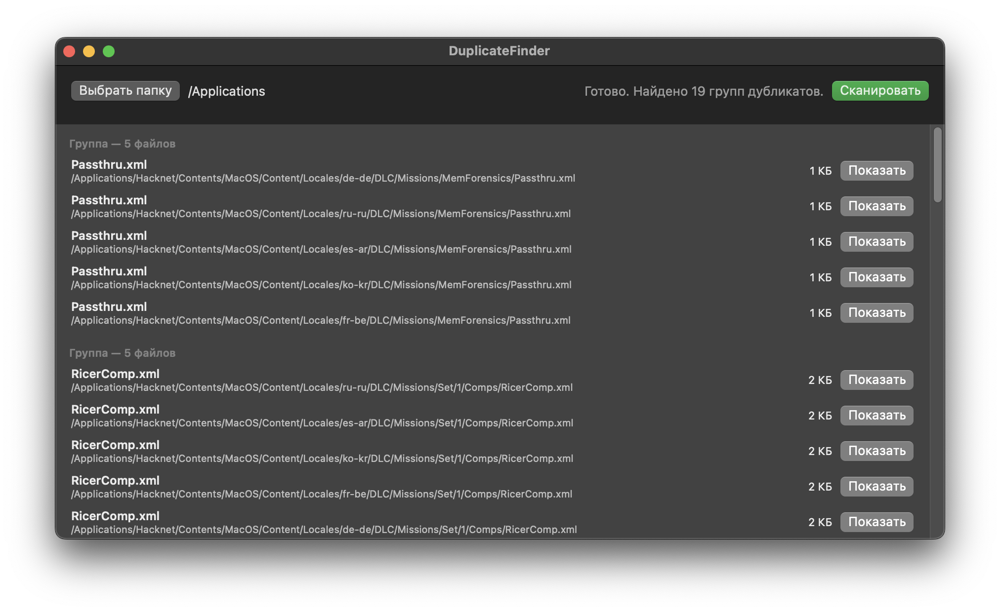
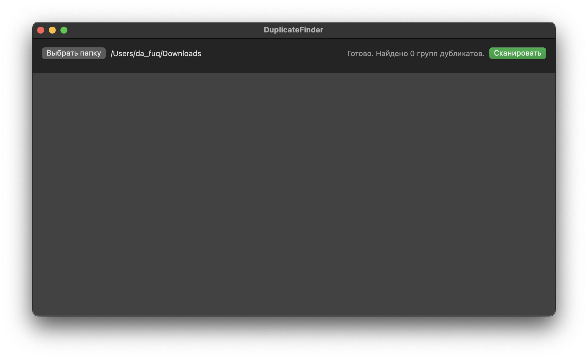

# DuplicateFinder (macOS)

DuplicateFinder — системная утилита для macOS, предназначенная для поиска дубликатов файлов в заданной директории.
Программа анализирует файловую систему, выявляет одинаковые файлы по содержимому и отображает их в виде групп.
Проект реализован на языке Swift с использованием SwiftUI и предназначен для системы macOS.

## Пользовательский интерфейс

Пользовательский интерфейс простой, локализованный на русский язык через ключи локализации. Содержит в себе следующий функционал:

- Кнопка «Выбрать папку» — выбор директории для анализа.
- Кнопка «Сканировать» — запуск поиска дубликатов.
- Отображение прогресса сканирования.
- Список найденных групп дубликатов с указанием файлов и их размеров.
- Кнопка «Показать» — открытие файла в Finder.







## Как работает программа

Пользователь выбирает желаемую для анализа директорию, после чего нажимает кнопку "Сканировать".

В случае, если есть найденные дубликаты, пользователю показываются группы файлов с одинаковой хеш-суммой и возможность перейти к ним для дальнейших действий (посмотреть/удалить).

Алгоритм поиска дубликатов состоит из нескольких этапов:

- Рекурсивный обход директории
  - Выполняется сбор всех обычных файлов в выбранной папке и её подкаталогах.
- Группировка по размеру файла
  - Файлы с разным размером не могут быть дубликатами, поэтому они исключаются из дальнейшего анализа.
- Хеширование файлов
  - Для файлов одинакового размера вычисляется криптографический хеш SHA-256.
  - Хеширование выполняется асинхронно, что снижает нагрузку на память и ускоряет работу.
- Группировка по хешу
  - Файлы с одинаковым хешем считаются дубликатами и объединяются в группы.
- Сортировка результатов
  - Группы дубликатов сортируются по количеству файлов.

## Используемые алгоритмы

Использованные алгоритмы и структуры данных:

- линейный поиск при обходе файловой системы;
- хеш-таблицы (Dictionary) для группировки;
- фильтрация и сортировка массивов;
- параллельная обработка данных (Swift Concurrency).

## Архитектура

В проекте используется паттерн MVVM, где:

- View — отображение данных;
- ViewModel — логика и алгоритмы;
- Model — структуры данных.

## Структура проекта

```zsh
DuplicateFinder
├── App
│   └── DuplicateFinderApp.swift      // Точка входа приложения
├── Models
│   ├── FileEntry.swift               // Модель файла
│   └── DuplicateGroup.swift          // Модель группы дубликатов
├── Services
│   ├── FileCollector.swift           // Сбор файлов из директории
│   └── HasherService.swift           // Хеширование файлов (SHA-256)
├── ViewModels
│   └── ScannerViewModel.swift        // Бизнес-логика и алгоритмы
├── Views
│   └── ContentView.swift             // Пользовательский интерфейс
├── Utilities
│   └── Extensions.swift              // Вспомогательные расширения
├── ru.lproj
│   └── Localizable.strings            // Русская локализация
└── SampleData                         // Тестовые файлы
```

## Сборка и запуск

Для запуска уже готового приложения можно использовать дистрибутивную копию в директории DuplicateFinderApp/DuplicateFinder.app.

## Сборка из исходного кода

Для простого тестирования требуется просто собрать проект под профилем "Testing" и запустить его.

Для сборки дистрибутива:

- Открыть проект в Xcode
- Выбрать схему DuplicateFinder и устройство Mac
- Выполнить Product → Archive
- В окне Organizer выбрать Distribute App → Copy App
- Полученный файл DuplicateFinder.app можно запускать вне Xcode

## Системные требования

- macOS
- XCode (только для сборки из исходного кода)

## Текущие ограничения

- Время работы зависит от количества и размера файлов. В среднем алгоритм близок к линейному.
  - Пусть n — количество файлов:<br/>
    - обход файловой системы: O(n);
    - группировка по размеру: O(n);
    - хеширование: O(k), где k — количество кандидатов на дубликаты;
    - группировка по хешу: O(k);
    - сортировка групп: O(m log m), где m — количество групп.

- Не поддерживается удаление файлов. Данное ограничение связано с безопаностью системы MacOS и требует задания специальных прав доступа к диску у приложения. В текущем варианте пользователь может сам перейти к файлу и решить, какое действие предпринять дальше – утилита только аггрегирует информацию по потенциальным дубликатам файлов.
